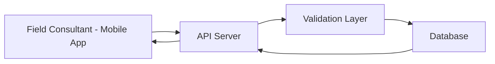

# Mobile Data Collection API

## Overview
This API supports a mobile application used by field consultants to collect and manage farmer data across FPOs.

---

## Data Flow



## Base URL
https://api.farmerdata.app/v1

---

## Authentication

All requests require a Bearer Token.

### Header Example
Authorization: Bearer <access_token>

---

## Endpoints

### 1. Submit Farmer Data

**POST** `/collect-data`

**Description:**  
Creates a new farmer record.

#### Request Parameters

| Field             | Type   | Required | Description                     |
|------------------|--------|----------|---------------------------------|
| farmer_id        | string | Yes      | Unique identifier for the farmer |
| name             | string | Yes      | Name of the farmer              |
| crop_type        | string | Yes      | Type of crop cultivated         |
| land_size_acres  | number | Yes      | Size of land in acres           |
| location         | string | No       | Farmer’s location               |
| collection_date  | date   | Yes      | Date of data collection         |

All required fields must be included in the request body. Optional fields may be omitted if not available.

#### Request Body

```json
{
  "farmer_id": "FPO12345",
  "name": "Ramesh Das",
  "crop_type": "Rice",
  "land_size_acres": 2.5,
  "location": "Nadia, West Bengal",
  "collection_date": "2023-09-15"
}
```

### Response

```json
{
  "status": "success",
  "message": "Farmer data recorded successfully",
  "record_id": "REC67890"
}
```

### 2. Fetch Farmer Records

**GET** `/farmer-records`

**Description:**  
Retrieves farmer records based on filters.

#### Query Parameters

| Parameter   | Type   | Description        |
|------------|--------|--------------------|
| location   | string | Filter by location |
| start_date | date   | Filter from date   |

#### Response

```json
{
  "status": "success",
  "data": [
    {
      "farmer_id": "FPO12345",
      "name": "Ramesh Das",
      "crop_type": "Rice"
    }
  ]
}
```

### 3. Update Farmer Record

**PUT** `/update-record/{record_id}`

**Description:**  
Updates an existing farmer record.

#### Request Body

```json
{
  "crop_type": "Wheat",
  "land_size_acres": 3
}
```

#### Response

```json
{
  "status": "success",
  "message": "Record updated successfully"
}
```

---

## Error Handling

### Example Error Response

```json
{
  "status": "error",
  "message": "Invalid farmer ID"
}
```

### Error Code

| Code | Meaning      |
| ---- | ------------ |
| 400  | Bad request  |
| 401  | Unauthorized |
| 404  | Not found    |
| 500  | Server error |

